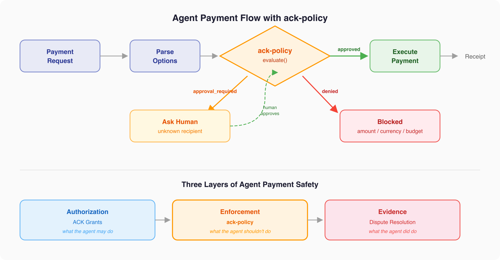

# ack-policy

When an AI agent spends money on your behalf, something needs to say "no" before the money moves. ack-policy is that gate.

A policy engine for [Agent Commerce Kit](https://github.com/agentcommercekit/ack) that enforces spend limits, recipient rules, and rolling budgets on agent payments — before they execute.



## Why

A per-transaction cap isn't enough. An agent with a $5 limit can make twenty $5 payments and spend $100. ACK's demo includes a [minimal policy check](https://github.com/agentcommercekit/ack/blob/main/demos/payments/src/payment-policy.ts) that does exactly this — per-transaction caps and a recipient allowlist. It works for a demo. It doesn't work for production.

ack-policy adds what the demo left out: cumulative budgets over rolling time windows, atomic check-and-reserve to prevent split attacks, and a three-valued decision model that lets a human break the tie on edge cases instead of hard-blocking everything.

## Install

```bash
npm install ack-policy
```

Peer dependency: [`agentcommercekit`](https://github.com/agentcommercekit/ack) for the `PaymentOption` type.

## Quick example

```typescript
import { definePolicy, evaluate } from "ack-policy"

const policy = definePolicy({
  maxAmount: {
    USDC: 5_000_000n,  // 5.00 USDC per transaction (6 decimals)
    USD: 500n,          // 5.00 USD per transaction (2 decimals)
  },
  recipients: {
    allow: ["did:web:staples.com", "did:web:amazon.com"],
  },
})

const decision = await evaluate(policy, { paymentOption })

if (decision.status === "approved") {
  // safe to execute
}

if (decision.status === "approval_required") {
  // recipient isn't pre-authorized — ask the human
  console.log(decision.reason)
}

if (decision.status === "denied") {
  // hard constraint violated — do not execute
  console.log(decision.reason)
}
```

### With a rolling budget

```typescript
import { definePolicy, evaluate, createMemoryStore } from "ack-policy"

const policy = definePolicy({
  maxAmount: { USDC: 10_000_000n },
  recipients: { allow: ["did:web:staples.com"] },
  budget: {
    windowMs: 24 * 60 * 60 * 1000,  // 24-hour rolling window
    maxAmount: { USDC: 50_000_000n }, // 50 USDC per day cumulative
  },
})

const store = createMemoryStore()

const decision = await evaluate(policy, {
  paymentOption,
  agentDid: "did:web:my-agent.com",
  store,
  requestId: "order-123",
})
```

The budget tracks cumulative spend per agent, per currency. Twenty $5 payments against a $50 daily limit — the first ten pass, the eleventh is denied.

## Features

**Per-transaction checks** — per-currency amount limits in smallest subunits (bigint), recipient allowlists and denylists, currency allowlists, and three-valued decisions (`approved`, `approval_required`, `denied`).

**Rolling window budgets** — cumulative spend tracking over configurable time windows with atomic check-and-reserve to prevent split attacks. Per-agent, per-currency isolation. Idempotent evaluation via `requestId` — retries don't double-count. Commit on payment success, release on failure.

**Pluggable storage** — `PolicyStore` interface with an in-memory implementation for testing. Implement the interface for Redis, Postgres, or any persistent backend.

### Planned

**Grant integration** — cross-check payments against ACK v2 grant claims (scope, audience, constraints, expiry). Waiting on v2 landing in ACK core.

## Documentation

- **[Getting Started](./docs/getting-started.md)** — full walkthrough with budgets, commit/release lifecycle
- **[API Reference](./docs/api.md)** — every exported function, type, and interface
- **[Architecture](./docs/architecture.md)** — where ack-policy sits in the ACK ecosystem and why certain decisions were made

## Relationship to ACK

This is a companion package, not a fork. It imports ACK's published types (`PaymentOption`) but is maintained separately. The ACK maintainer considers runtime policy enforcement [out of scope for the core protocol](https://github.com/agentcommercekit/ack/issues/138).

ack-policy complements the [dispute resolution proposal](https://github.com/agentcommercekit/ack/issues/217): grants define what an agent *may* do, the policy engine prevents what it *shouldn't* do at runtime, and dispute evidence proves what it *did* do after the fact.

## License

MIT
